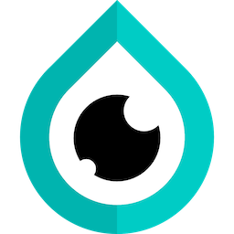

# Eyedrop

Starter project for a game engine in C++ using Sokol and ImGui. Build with cmake.

## Status

<b>***** NOT IN ACTIVE DEVELOPMENT *****</b>

 

Current efforts are targeted on the [Onsight Engine](https://github.com/onsightengine).

## License

Released under the terms of the MIT license, so it is free to use in your free or commercial projects.

Copyright (c) 2020-2022 Stephens Nunnally and Scidian Studios
